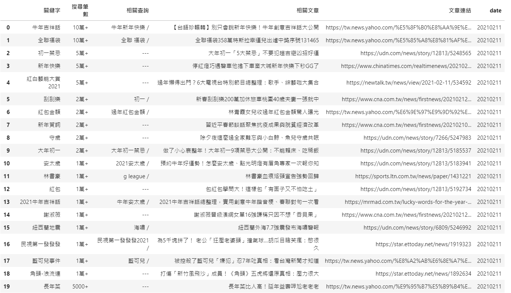

# Google-Trends-Crawler

## 功能

* 利用 Google 趨勢的 API 爬取近一個月的資料，並收集搜尋字詞製作字典

## 使用方式：
```
$ python trends_crawler.py
```

## 資料
* data_tw/、data_jp/
    * 儲存每日趨勢的資料為 .pkl 檔
    * 爬取的資料如下
    

* keyword_tw.txt / keyword_jp.txt
    * 將搜尋字詞存為字典
    * 每次新增的字詞會新增到文件最後
